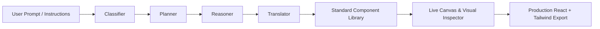

#  AuraDesign // AI Frontend Canvas Engine

<p align="center">
  
</p>

<p align="center">
  <strong>Next-Generation AI-Powered Visual Web Builder & Design Orchestrator</strong><br>
  Create, orchestrate, and export high-performance, Framer-grade React interfaces with local AI intelligence and rich motion physics.
</p>

<p align="center">
  <a href="https://react.dev/"></a>
  <a href="https://vite.dev/"></a>
  <a href="https://tailwindcss.com/"></a>
  <a href="https://motion.dev/"></a>
  <a href="https://gsap.com/"></a>
  <a href="https://ollama.com/"></a>
  <a href="LICENSE"></a>
</p>

---

## 📖 Table of Contents

- [Overview](#-overview)
- [Key Features](#-key-features)
- [Design & Effects Library](#-standard-component--effects-library)
- [Architecture & AI Pipeline](#-architecture--ai-pipeline)
- [Tech Stack](#-tech-stack)
- [Getting Started](#-getting-started)
  - [Prerequisites](#prerequisites)
  - [Installation](#installation)
  - [Local AI Setup (Optional)](#setting-up-local-ai-with-ollama-optional)
  - [Running the Application](#running-the-application)
- [Available Scripts](#-available-scripts)
- [Project Structure](#-project-structure)
- [Roadmap & Contributing](#-roadmap--contributing)
- [License & Credits](#-license--credits)

---

## 🌟 Overview

**AuraDesign** is an intelligent visual design studio and AI orchestrator designed to bridge the gap between creative visual building and production-grade code generation.

Unlike traditional website builders that output messy DOMs or rigid templates, AuraDesign leverages a **bounded component and motion effects engine** powered by **local LLMs (via Ollama)** to construct responsive, fluid, and modern web pages with buttery-smooth physics, interactive 3D WebGL globes, GSAP scroll triggers, and Lenis smooth scrolling.

---

## 🚀 Key Features

### 🧠 1. Multi-Stage AI Design Orchestrator
- **Zero Hallucination Bounded Design**: Directs AI to assemble from vetted high-performance patterns rather than guessing styles.
- **Intelligent Pipeline**:
  - `Classifier`: Categorizes requests (`new_project`, `redesign`, `add_section`, `edit_component`).
  - `Planner`: Creates structured multi-step execution plans.
  - `Reasoner`: Selects compatible color palettes, typography pairings, and layout structures.
  - `Translator`: Emits schema-compliant component declarations and live updates.
- **Local Privacy**: Runs offline with your local Ollama models (Llama 3, Qwen 2.5 Coder, Mistral, DeepSeek, etc.).
- **Real-Time Streaming**: Watch the AI reasoning process and component generation live in the side panel.

### 🎨 2. Visual Canvas & Responsive Viewports
- **Live Interactive Canvas**: Real-time rendering with instant visual feedback.
- **Responsive Preview Switching**: Test designs seamlessly across **Desktop (100%)**, **Tablet (768px)**, and **Mobile (375px)**.
- **Component Reordering & Management**: Drag, reorder, clone, configure, or remove sections on the fly.
- **Complete Undo / Redo**: Multi-level state history tracking across all visual actions.

### 🎛️ 3. Visual Property Inspector
- Precision style editing for text content, headings, subtext, colors, gradients, padding, alignment, and interactive behaviors without touching code.

### 💾 4. Production-Ready Code Export
- Export clean, modular, and unbloated **React + Tailwind CSS** components.
- Instant code preview with copy-to-clipboard and single-file bundle export.

### 📂 5. Project Hub & Preset System
- Multi-project management with browser persistence (`localStorage`).
- Pre-built templates (SaaS, Studio, Portfolio, E-Commerce, Dev Tools).
- Trash and instant project restoration.

---

## 🧩 Standard Component & Effects Library

AuraDesign includes curated, battle-tested UI patterns:

| Category | Components & Effects |
| :--- | :--- |
| **Hero Patterns** | • Animated Gradient Hero<br>• Interactive 3D Globe Hero<br>• Product Mockup Hero with Tilt<br>• Parallax Image Background<br>• Split-Screen Hero<br>• Autoplay Video Background |
| **Scroll-Driven Motion** | • Scroll-Fill Device Mockup (Framer-style screen swap)<br>• Pinned Sticky Sections<br>• Split-Text Scroll Reveals<br>• Horizontal Scroll Gallery<br>• Scroll-Triggered Animated Counters<br>• Parallax Layered Images |
| **3D & Cursor FX** | • Standalone WebGL Canvas Globe (Cobe)<br>• 3D Drag Object Viewer<br>• Mouse-Tilt 3D Cards<br>• Magnetic Interactive Buttons<br>• Dynamic Cursor Spotlight & Blob<br>• Ambient Particle Backgrounds |
| **Content & Layout** | • Asymmetric Bento Grids<br>• Infinite Seamless Logo Marquee<br>• Pricing Table with Billing Cycle Toggle<br>• Interactive FAQ Accordion<br>• Team Showcase Grid with Hover Reveals<br>• Testimonial Carousel with Embla |
| **Navigation & Footers** | • Sticky Blurred Glassmorphic Navbar<br>• Interactive Mega Menu<br>• Full-Screen Mobile Drawer<br>• Big Logotype Modern Footer<br>• Newsletter Lead Capture Footer |

---

## 🏗️ Architecture & AI Pipeline



---

## 🛠️ Tech Stack

- **Core Framework**: [React 19](https://react.dev/) + [Vite 8](https://vite.dev/)
- **Styling**: [Tailwind CSS v4](https://tailwindcss.com/)
- **Motion & Physics**:
  - [Framer Motion](https://motion.dev/) — Interactive transitions & spring animations
  - [GSAP](https://gsap.com/) (`ScrollTrigger`, `ScrollSmoother`) — Pinning & scroll scrub sequences
  - [Lenis](https://lenis.darkroom.engineering/) — Hardware-accelerated smooth scrolling
- **3D & Visuals**: [Cobe](https://github.com/shuding/cobe) — Lightweight, high-performance WebGL Globe
- **UI & Icons**: [Lucide React](https://lucide.dev/)
- **Carousels & Data**: [Embla Carousel](https://www.embla-carousel.com/), [Recharts](https://recharts.org/), [React-CountUp](https://github.com/glennreyes/react-countup)
- **Local AI**: [Ollama REST API](https://github.com/ollama/ollama)
- **Linter**: [Oxlint](https://oxc.rs/)

---

## 💻 Getting Started

### Prerequisites

- **Node.js**: `v18.0.0` or higher installed on your system ([Download Node.js](https://nodejs.org/))
- **npm** (comes with Node) or **pnpm** / **yarn**
- **Git** installed on your system

---

### Installation

1. **Clone the repository:**
   ```bash
   git clone https://github.com/Mohammedismail-cyber/designer.git
   cd designer
   ```

2. **Install dependencies:**
   ```bash
   npm install
   ```

---

### Setting Up Local AI with Ollama (Optional)

AuraDesign works completely offline without AI using visual tools and prebuilt presets. If you want AI-assisted page generation and copilot capabilities:

1. **Download & Install Ollama** from [ollama.com](https://ollama.com/).
2. **Pull a recommended model** in your terminal:
   ```bash
   # Recommended for code and design generation:
   ollama pull qwen2.5-coder:7b
   
   # Or Llama 3:
   ollama pull llama3:8b
   ```
3. **Start the Ollama server** (if not already running as a system service):
   ```bash
   ollama serve
   ```
4. AuraDesign will automatically detect your local models running at `http://localhost:11434`. You can change the host or model directly within the **Agent Panel** or **Settings Modal**.

---

### Running the Application

Start the local development server:

```bash
npm run dev
```

Open your browser and navigate to:
```
http://localhost:5173
```

---

## 📜 Available Scripts

| Command | Description |
| :--- | :--- |
| `npm run dev` | Launches the local Vite development server with Hot Module Replacement (HMR) |
| `npm run build` | Builds optimized production bundle in the `dist/` directory |
| `npm run preview` | Locally preview the built production app |
| `npm run lint` | Runs Oxlint for lightning-fast code quality inspection |

---

## 📂 Project Structure

```text
designer/
├── public/                     # Static assets & SVG icons
│   ├── favicon.svg
│   └── icons.svg
├── src/
│   ├── assets/                 # Brand assets & images
│   ├── components/             # Core studio components
│   │   ├── AgentPanel.jsx      # AI Copilot & prompt orchestrator
│   │   ├── Canvas.jsx          # Visual interactive layout canvas
│   │   ├── Inspector.jsx       # Visual style & property editor
│   │   ├── LandingPage.jsx     # Marketing & feature showcase
│   │   ├── ProjectsHub.jsx     # Project dashboard & templates
│   │   ├── ExportModal.jsx     # Clean code export dialog
│   │   ├── PreviewModal.jsx    # Responsive fullscreen preview
│   │   ├── SettingsModal.jsx   # Model & environment configurations
│   │   ├── Sidebar.jsx         # Component palette & tree
│   │   └── library/            # Curated component & effect modules
│   │       ├── content/        # Bento grids, FAQ, Pricing, Marquee
│   │       ├── footer/         # Logotype & Newsletter footers
│   │       ├── forms/          # Multi-step & Floating label inputs
│   │       ├── hero/           # Globe, Gradient, Split, Mockup heroes
│   │       ├── interaction/    # Magnetic buttons, Tilt cards, Spotlights
│   │       ├── media/          # Before/After, Lightboxes, Video cards
│   │       ├── navigation/     # Blurred navs, Mega menus, Drawers
│   │       └── scroll/         # Pinning, Scroll-fill, Parallax
│   ├── utils/
│   │   ├── export/             # React & Tailwind code generation
│   │   ├── orchestrator/       # Classifier, Planner, Reasoner, Translator
│   │   ├── templates/          # Ready-to-use project presets
│   │   └── generator.js        # Component instantiator & Ollama client
│   ├── App.jsx                 # Main application state machine
│   ├── index.css               # Global styles & design system tokens
│   └── main.jsx                # Application root mount
├── package.json
├── vite.config.js
└── README.md
```

---

## 🤝 Contributing

Contributions are always welcome! Whether it's adding new motion components, improving AI orchestrator prompts, or optimizing performance:

1. **Fork the repository**
2. **Create your feature branch**: `git checkout -b feature/amazing-feature`
3. **Commit your changes**: `git commit -m "feat: add amazing feature"`
4. **Push to the branch**: `git push origin feature/amazing-feature`
5. **Open a Pull Request**

---

## 📄 License & Credits

Distributed under the **MIT License**.

Crafted by **[Mohammedismail-cyber](https://github.com/Mohammedismail-cyber)**. Built with React, Vite, Framer Motion, and Tailwind CSS.
